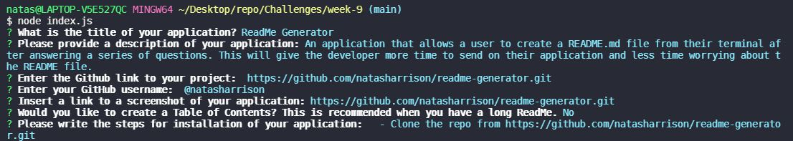

# README Generator

## Description 

An application that allows a user to create a README.md file from their terminal after answering a series of questions. This will give the developer more time to send on their application and less time worrying about the README file. 

## Installation 
 - Clone the repo from https://github.com/natasharrison/readme-generator.git
 - npm install any required npm dependencies 

 ## Usage
 - The user will be asked a series of questions within the terminal once the command 'node index.js' is invoked.
 - 
 - ![Screencastify] <iframe src="https://drive.google.com/file/d/1HLksXVLyCJVt2btv8ZTf8dfHU-1pV5Bv/preview" width="640" height="480"></iframe>

